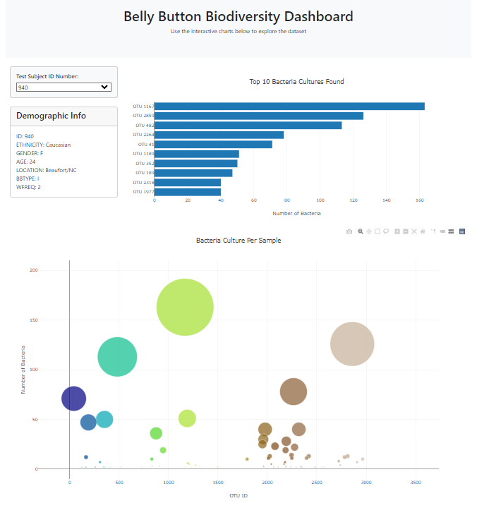

# belly-button-challenge
# BellyButtonChallenge

An interactive dashboard built using HTML, Javascript and the D3.js library that explores NC State's Public Science Lab Belly Button Biodiversity dataset, which catalogs the microbes that colonize human navels.

<strong>Project can also be viewed as a GitHub Page at the following link:  
https://dpineda6988.github.io/belly-button-challenge/ </strong>

## Description

The Public Science Lab at NC State launched a study in January 2011 to investigate the microbes inhabiting our navels and the factors that might influence the microscopic life calling this protected, moist patch of skin home.  The Belly Button Biodiversity project began locally in the Raleigh-Durham area but was eventually opened up to people all over North America due to popular demand.

The resulting dataset revealed that a small handful of microbial species (also called operational taxonomic units, or OTUs, in the study) were present in more than 70% of people, while the rest were relatively rare.

This project uses a portion of the comprehensive dataset to create an interactive dynamic dashboard that highlights some key metadata on the each study subject and data visualizations  portrays the that I've  creates an interactive dashboard that can be opened up with any

This project uses a combination of HTML, JavaScript, and the D3.js library to present a portion of the dataset in the form of an interactive dynamic dashboard.  This dashboard displays data for individual study participants which a user can select from a drop down list based upon study subject ID.  Making a selection will display some topline metadata on the selected subject (such as participant ID, ethnicity, gender, age, etc.) as well as two graph visualizations that display the folowing:
* A horizontal bar chart that displays the OTUs with the highest measured number in the selected subject (max top 10)
* A bubble chart that also visually displays the number of bacteria per OTU found in the subject, where the where size of the bubble for any given OTU is relative to the number of that OTU present in the subject

### Screenshot of Output

### Dependencies
* Any web browser program that will open 'index.html' (Google Chrome is recommended)
* An active internet connection so taht 'index.html' can access the dataset url and the necessary libraries.

### Installing & Execution
The repository files can be downloaded to open 'index.html'  Note that since 'index.html' contains relative file paths, it is important that the file locations within the BellyButtonChallenge directory are not changed in order to execute properly.

<strong>Note</strong>: file 'samples.json' contains a copy of the json data that is used in the dashboard but is only provided for reference and is not needed to execute the dashboard coded in 'index.html'

## Authors

Daniel Pineda

## Acknowledgments
BellyButtonChallenge was created as an assignment for the University of California, Irvine Data Analytics Bootcamp - June 2024 Cohort under the instruction and guidance of Melissa Engle (Instructor) and Mitchell Stone (TA).
The practical exercises and coding examples demonstrated through the bootcamp helped inform and inspire the code for this project.

Additionally, the following resources were used for further reference:

* Xpert Learning Assistant - UCI's AI-powered learning assistant - referenced for how loop through filtered d3.json data ('app.js' - lines 18-20)
* [Plotly JavaScript Open Source Graphing Library](https://plotly.com/javascript/) - referenced for syntax and structure of creating the bubble graph and bar graph ('app.js - lines 42-116)